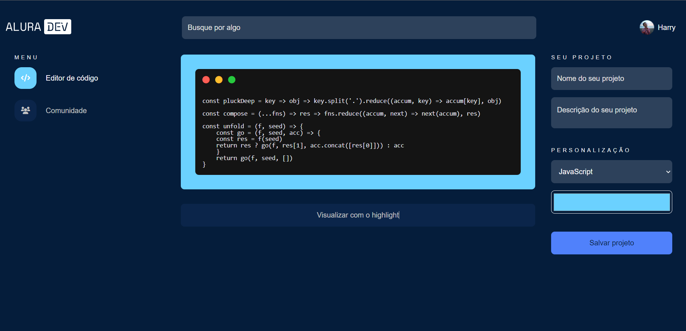

# AluraDev
AluraDev editor de código online projeto proposto no alura challenge front end

Foi implementados dos os desafios da semana 2 fazer o highlight Funcionar e criar a pagina de comunidade 

# Como rodar o projeto local

Basta digita este o código `git clone https://github.com/wesleyLM/AluraDev` no terminal e encontre o arquivo `index.html` clique nele, para iniciar o projeto no seu navegador

## Como utilizar

- Para utilizar o editor de código, basta clicar no bloco preto e começar a digitar, após ter digitado o seu código, clique em "Vidualisar com o highlight" 

 - Para alterar a cor de fundo do editor, clique no color picked abaixo de personalização e escolha a cor desejada. 

## Conteúdos

- [Overview](#overview)
  - [O Challenge](#the-challenge)
  - [Screenshot](#screenshot)
  - [Links](#links)
- [Processo](#processo)
  - [Contruido com](#construido-com)
  - [O que eu aprendi](#oque-eu-aprendi)
  - [Continuação do desenvolvimento](#continuacao-do-desenvolvimento)
  - [Recursos úteis](#recursos-uteis)
- [Autor](#autor)

### O Challenge

Os usuarios serão capazes de:

- Criar um código e setar o highlight

### Screenshot

### Links

- Site hospedado: [Alura Dev](https://alura-dev-git-main-wesleylm.vercel.app/)

## Processo

### Construito com

- Tags HTMl semânticas
- CSS
- Flexbox
- JavaScript

### O que eu aprendi

- Utilizar bibliotecas como:
  - [Highlight JS](https://highlightjs.org/)
- Utilizar o trello para organizar minhas tarefas.

### Continuação do desenvolvimento

Pretendo adicionar algumas features como:

- Alterar nome e foto de perfil
- Dar like
- Ver perfil
- Adicionar github no perfil
- Barra de pesquisa funcional
- Salva o projeto na pagina de comunidade
- Editar o processo apos salvo
- Pagina Style guide
- Exporta código por meio de imagem ou código preferido

## Autor

- GitHub - [mateushenrique-dev](https://github.com/wesleyLM)

